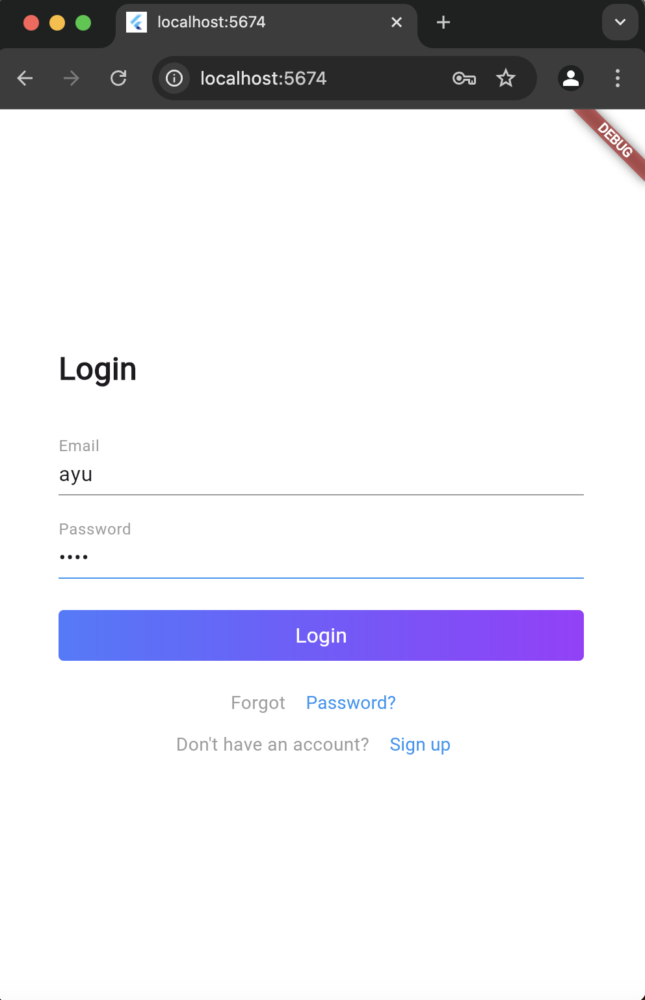
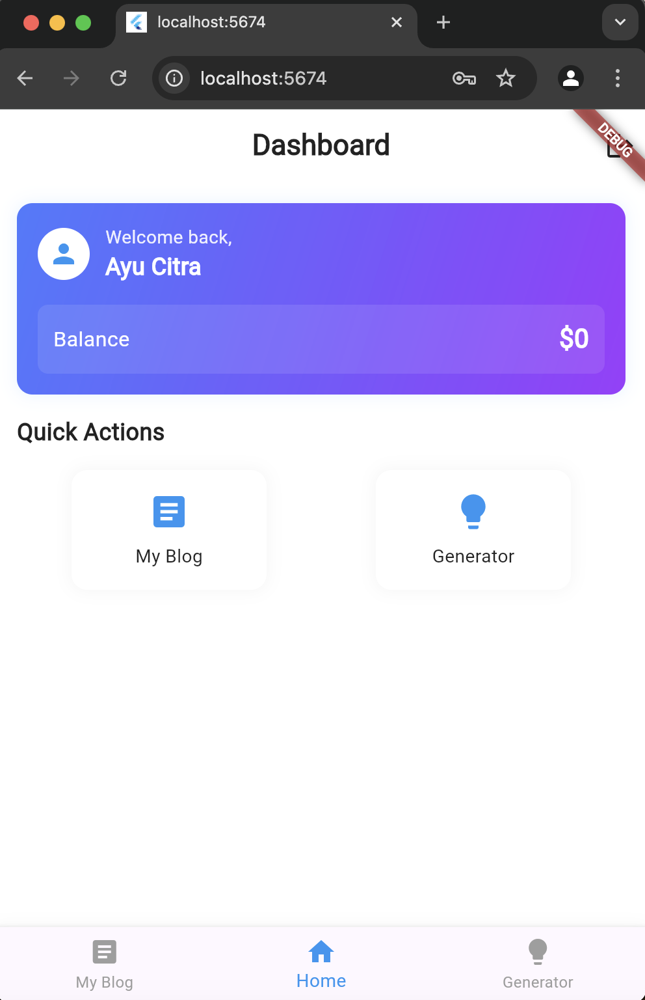
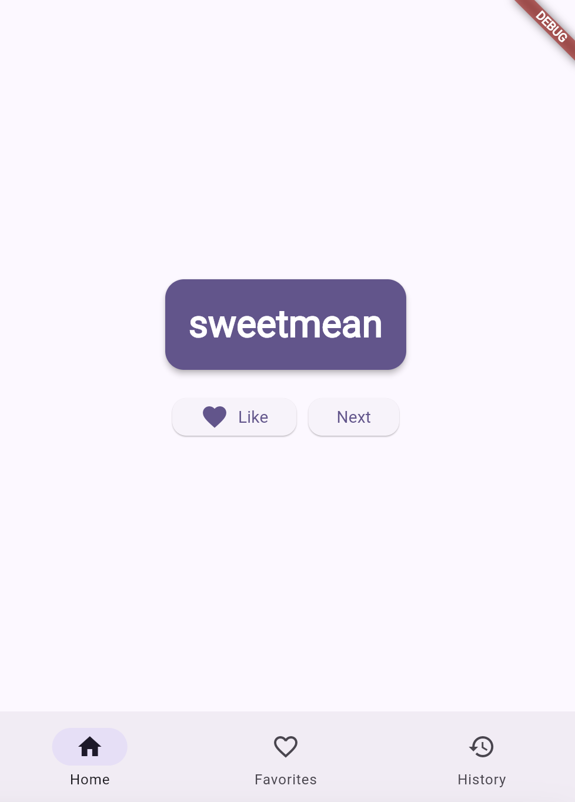

# 📱 Flutter Project Name

> Brief description of your app—what it does and why it’s awesome!

 

### ✨ Features
- **Feature 1** - Login and Auth
- **Feature 2** - Home Page.
- **Feature 3** - Backend using Golang.

### 📸 Screenshots

| Home Screen | Feature Screen 1 | Feature Screen 2 |
| --- | --- | --- |
|  |  |  |

---

## 🚀 Getting Started

These instructions will help you set up and run the project on your local machine.

### Prerequisites

Make sure you have the following installed:
- **Flutter SDK**: [Install](https://flutter.dev/docs/get-started/install)
- **Dart SDK**: Comes with Flutter
- **Android Studio / Xcode**: For iOS and Android emulator

### Installation

1. **Clone this repository**
   ```bash
   git clone https://github.com/bayyy7/simple-flutter.git
   cd simple-flutter
   ```

2. **Install dependencies**
   ```bash
   flutter pub get
   ```

3. **Run the app on PORT 5674**
   ```bash
   flutter run -d chrome --web-port 5674
   ```

---

## 📂 Folder Structure

Here’s an overview of the project’s folder structure:

```
flutter_project_name/
├── lib/
│   ├── auth              # Auth using cubit
│   ├── home              # Home screen
│   ├── login             # Login scree
│   ├── user_list         # User List
│   └── wise_word         # Wise Words
└── packages/             # consume API using Dio
```

---

## 🤝 Contributing

We welcome contributions! To get started:

1. **Fork the repository**.
2. **Create a new branch** with a descriptive name.
3. **Commit your changes** with clear messages.
4. **Open a Pull Request**.

---

## 🧩 Plugins & Packages Used

- **Cubit**: State management solution.
- **Dio**: For API calls and network requests.

---


Happy coding! 🎉